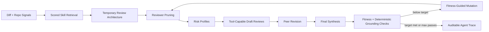

# ReviewStem: A Bounded Stem Agent for Pull Request Review

ReviewStem is a self-specializing agentic system for pull request review. It specializes at runtime by reading the diff and repository, retrieving scored skills, constructing temporary reviewer architectures, running review passes with tool access, validating results with deterministic grounding checks, mutating the architecture when fitness is low, and stopping at a bounded target score or maximum iterations.

## Quick Start

```bash
# Install
pip install -e .

# Configure (create .env from .env.example)
OPENAI_API_KEY=your_key_here
REVIEWSTEM_MAX_ITERATIONS=2
REVIEWSTEM_TARGET_SCORE=0.90

# Run
reviewstem review
reviewstem benchmark
reviewstem doctor
```

## Architecture



**Why this is a stem agent, not just a prompt chain:**

- Reads environment signals from diff, repository map, and file tool calls
- Performs deterministic scored skill retrieval from `skills/skills.json`
- Builds explicit reviewer genomes as temporary review architecture
- Uses bounded `read_file` tool during draft review
- Validates output with 8 types of deterministic grounding checks
- Mutates reviewer architecture based on fitness feedback
- Persists auditable agent trace with tool calls and mutation deltas
- Stops by target score or max iterations

## Core Components

### 1. Specialization State (`reviewstem/state.py`)
Runtime state tracking selected skills, reviewer genomes, tool calls, fitness scores, mutation deltas, and stop reason. Serialized to `outputs/specialization_state_*.json`.

### 2. Scored Skill Retrieval (`reviewstem/epigenetics.py`)
Deterministic weighted term matching across skill name, trigger, risk profile, context plan, checklist, test templates, source case, and success score. Returns ranked skills with retrieval reasons.

### 3. Temporary Review Architecture (`reviewstem/stem_cell.py`)
Constructs specialized reviewer genomes from selected skills. Each reviewer has a focus area, risk profile, and tool access.

### 4. Tool-Capable Reviewers (`reviewstem/motor_cortex.py`)
Draft reviewers can call `read_file` to inspect repository context. Tool calls are recorded in the specialization state.

### 5. Fitness Function (`reviewstem/fitness_function.py`)
Evaluates review quality with 8 deterministic grounding checks:
- Hallucinated files (files that don't exist)
- Vague locations (missing file/line references)
- Generic advice (no specific code references)
- Redundant comments (duplicate findings)
- Off-topic comments (unrelated to diff)
- Weak fixes (no actionable suggestions)
- Severity mismatch (incorrect severity levels)
- Missing context (ignoring repository state)

### 6. Mutation Engine (`reviewstem/mutation_engine.py`)
Generates new reviewer genomes based on fitness feedback. Mutation deltas are deterministic and recorded in the specialization state.

## Skills

Curated skill memory in `skills/skills.json`:

- **SQL Injection and Unsafe Query Construction Review** - Detects unsafe SQL interpolation
- **Admin Route Authentication/Authorization Review** - Finds missing auth checks on admin routes
- **Cache Invalidation Audit** - Identifies stale cache bugs in update paths
- **Backend API Swallowed Error Review** - Catches unhandled promise rejections
- **Low-Context PR Triage** - Validates repository structure and file existence

Skills are retrieved using weighted term matching and scored by relevance to the current diff.

## Benchmark

`reviewstem benchmark` compares three approaches:

1. **Generic baseline** - Single generic review prompt
2. **Generic+Skills baseline** - Generic prompt with selected skills appended
3. **ReviewStem** - Full specialization pipeline with tool access, mutation, and grounding checks

### Benchmark Cases

**Original cases:**
- `sql_injection` - Unsafe SQL interpolation
- `admin_auth` - Missing authorization on admin route
- `cache_invalidation` - Stale cache after update

**Context-required cases:**
- `route_mounting_auth_bypass` - Admin router mounted before auth middleware
- `cache_key_mismatch` - Cache key inconsistency between read/write
- `async_swallowed_error` - Unhandled promise rejection

### Fair Scoring

The benchmark scorer uses **related files** and **concept groups** rather than exact wording:

- **Related files**: Accepts findings in any file that contributes to the issue (e.g., `admin_auth` accepts `src/index.ts`, `src/routes/admin.ts`, or `src/middleware/auth.ts`)
- **Concept groups**: Matches semantic concepts rather than exact keywords (e.g., ["auth", "authentication", "requireAuth"] are equivalent)
- **Line tolerance**: Accepts findings within ±1 line of expected location

This avoids false negatives where the reviewer correctly identifies the root cause but cites a different (but valid) file or line.

### Benchmark Saturation

Some cases saturate because the generic baseline already catches obvious issues. Context-required cases evaluate whether ReviewStem's specialization provides additional evidence through tool use and repository-aware review.

## Agent Trace Artifacts

Every ReviewStem run writes specialization state:

- Normal review: `outputs/specialization_state.json`
- Benchmark case: `outputs/specialization_state_<case_id>.json`
- Markdown summary: `outputs/specialization_state_<case_id>.md`

These files show:
- Selected skills and retrieval reasons
- Initial and pruned reviewer genomes
- Risk profiles
- Tool calls (read_file events)
- Deterministic grounding penalties
- Mutation deltas
- Score history
- Model call count
- Stop reason

## Environment Variables

```bash
# Required
OPENAI_API_KEY=your_key_here

# Optional (defaults shown)
REVIEWSTEM_MODEL=gpt-4o-mini
REVIEWSTEM_MAX_ITERATIONS=2
REVIEWSTEM_TARGET_SCORE=0.90
REVIEWSTEM_TEMPERATURE=0
REVIEWSTEM_DIFF_LIMIT=12000
REVIEWSTEM_REPO_MAP_MAX_FILES=150
REVIEWSTEM_FILE_READ_LIMIT=8000
```

## Commands

```bash
# Review current git diff
reviewstem review

# Review with custom parameters
reviewstem review --max-iterations 3 --target-score 0.85

# Run benchmark suite
reviewstem benchmark

# Run specific benchmark case
reviewstem benchmark --benchmark-case admin_auth

# Check environment and dependencies
reviewstem doctor
```

## Verification

```bash
# Compile all modules
python -m compileall reviewstem tests

# Run tests
python -m pytest tests/ -v

# Check environment
reviewstem doctor

# Run benchmark
reviewstem benchmark
```

## What Makes This a Stem Agent

1. **Runtime specialization state** - Not source code modification, but explicit runtime state
2. **Scored skill retrieval** - Deterministic weighted term matching with auditable traces
3. **Tool-capable reviewers** - Draft reviewers can read files with recorded tool calls
4. **Fitness-guided mutation** - Architecture changes based on deterministic feedback
5. **Bounded stopping** - Target score or max iterations, not unbounded search
6. **Auditable trace** - Complete specialization state serialized to JSON

## Known Limitations

- LLM fitness remains in the loop (deterministic checks are grounding constraints, not complete proof)
- Skill retrieval uses term matching, not embeddings
- No persistent skill learning across runs
- Limited to file reading (no call graph or test graph tools)
- Single-run evaluation (no confidence intervals)

With more time, improvements would include embeddings-based retrieval, larger hidden benchmark suite, persistent learned skills, richer tool access, and multi-run statistical analysis.

## Project Structure

```
reviewstem/
├── __main__.py              # CLI entry point
├── state.py                 # SpecializationState schema
├── epigenetics.py           # Scored skill retrieval
├── stem_cell.py             # Temporary review architecture
├── motor_cortex.py          # Tool-capable reviewers
├── fitness_function.py      # Deterministic grounding checks
├── mutation_engine.py       # Fitness-guided mutation
├── immune_system.py         # Review synthesis
├── benchmark.py             # Benchmark scoring
└── schemas.py               # Data schemas

skills/
└── skills.json              # Curated skill memory

benchmark_repo/              # Test repository
tests/                       # Unit tests
outputs/                     # Specialization state artifacts
```

## License

MIT
