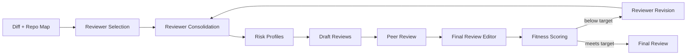

# ReviewStem: A Stem Agent for Pull Request Review

ReviewStem is a small stem-agent experiment for code review. It starts with a generic review task, reads environmental signals from the diff and repository, specializes into focused reviewers, checks its own output, and revises itself when the review does not meet the target score.

## Architecture



- **Environmental signals**: `git diff`, benchmark diffs, repository map, and reusable review guidance.
- **Specialization**: generated reviewer personas with focused checks for the current PR.
- **Tools**: repository file reading, structured Pydantic outputs, and reusable skill retrieval.
- **Safeguards**: final review editing, hallucinated-file checks, line validation, and fix-quality checks.
- **Stop condition**: `REVIEWSTEM_TARGET_SCORE`.

## Setup

```bash
pip install -e .
```

Create `.env` from `.env.example`:

```bash
OPENAI_API_KEY=your_key_here
REVIEWSTEM_MAX_ITERATIONS=2
REVIEWSTEM_TARGET_SCORE=0.90
REVIEWSTEM_TEMPERATURE=0
REVIEWSTEM_DIFF_LIMIT=12000
REVIEWSTEM_REPO_MAP_MAX_FILES=150
REVIEWSTEM_FILE_READ_LIMIT=8000
```

Only `OPENAI_API_KEY` is required. `REVIEWSTEM_MODEL` is optional and defaults to `gpt-5.4-mini`.

## Usage

Run the default review flow:

```bash
reviewstem
```

Run explicitly:

```bash
reviewstem review --max-iterations 2 --target-score 0.90
```

Run setup checks without an API call:

```bash
reviewstem doctor
```

Run the measurable baseline-vs-ReviewStem benchmark:

```bash
reviewstem benchmark --quiet
```

Run one benchmark case:

```bash
reviewstem benchmark --benchmark-case sql_injection --quiet
```

Benchmark reports are written to:

- `outputs/benchmark_results.json`
- `outputs/benchmark_results.md`

## Configuration

| Setting | Default | Purpose |
| --- | --- | --- |
| `REVIEWSTEM_MODEL` | `gpt-5.4-mini` | Model used for reviewer selection, draft reviews, synthesis, and scoring. |
| `REVIEWSTEM_MAX_ITERATIONS` | `2` | Maximum review/revision passes. |
| `REVIEWSTEM_TARGET_SCORE` | `0.90` | Fitness score needed to stop evolving. |
| `REVIEWSTEM_TEMPERATURE` | `0` | Lower randomness for repeatable benchmark runs. |
| `REVIEWSTEM_DIFF_LIMIT` | `12000` | Maximum diff characters sent to the model. |
| `REVIEWSTEM_REPO_MAP_MAX_FILES` | `150` | Maximum files included in the repo map. |
| `REVIEWSTEM_FILE_READ_LIMIT` | `8000` | Maximum characters returned by file-reading tool calls. |

CLI flags override env settings for a single run:

```bash
reviewstem review --model gpt-5.5 --target-score 0.95 --max-iterations 2
```

## Evaluation

`reviewstem benchmark` compares:

- **Baseline**: one generic review prompt.
- **ReviewStem**: reviewer selection, risk profiling, peer review, final editing, and fitness scoring.

The deterministic benchmark scorer checks:

- expected file
- expected line
- severity
- required keywords
- hallucinated files
- complete suggested fixes

Current benchmark cases:

- `sql_injection`
- `admin_auth`
- `cache_invalidation`

Latest measured run:

| Case | Baseline | ReviewStem | Delta |
| --- | ---: | ---: | ---: |
| `sql_injection` | 1.00 | 1.00 | +0.00 |
| `admin_auth` | 0.83 | 1.00 | +0.17 |
| `cache_invalidation` | 0.77 | 0.85 | +0.08 |

The SQL case is saturated because both the generic baseline and ReviewStem catch the obvious injection. The harder cases show the specialization pipeline improving over the generic prompt.

## Local Verification

```bash
python -m compileall reviewstem tests
python -m pytest
reviewstem doctor
```
