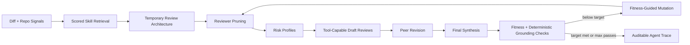

# ReviewStem: A Self-Evolving Security and Code Quality Review Agent

ReviewStem is a **self-evolving agentic system** for comprehensive pull request review. It detects security vulnerabilities, code quality issues, performance problems, and generates test cases. The agent **learns from successful reviews** and evolves across sessions by saving high-performing reviewer genomes as new skills.

## Key Features

### 🧬 Self-Evolution
- **Persistent Skill Learning** - Saves successful reviewer genomes after high-fitness reviews
- **Cross-Session Memory** - Learned skills are automatically loaded in future reviews
- **Usage Tracking** - Monitors which learned skills work best
- **Automatic Pruning** - Removes underperforming skills to maintain quality

### 🔒 Comprehensive Security Detection
- SQL Injection, XSS, Authentication/Authorization issues
- Input validation failures, cryptography weaknesses
- Information disclosure, error handling problems

### 🧪 Automatic Test Generation
- Security tests for all identified vulnerabilities
- Edge case tests, error path tests, regression tests

### 🎯 Runtime Specialization
- Scored skill retrieval based on diff content
- Temporary reviewer architectures with tool access
- Fitness-guided mutation within review sessions

## Quick Start

```bash
# Install
pip install -e .

# Configure (create .env from .env.example)
OPENAI_API_KEY=your_key_here
REVIEWSTEM_MAX_ITERATIONS=2
REVIEWSTEM_TARGET_SCORE=0.90

# Run
reviewstem review
reviewstem benchmark
reviewstem doctor
```

## What ReviewStem Detects

### Security Vulnerabilities
- **SQL Injection** - Unsafe query construction with user input
- **XSS (Cross-Site Scripting)** - Unsanitized user input in HTML output
- **Authentication/Authorization Issues** - Missing auth checks, privilege escalation
- **Input Validation Failures** - Path traversal, command injection, SSRF
- **Cryptography Weaknesses** - Weak algorithms, hardcoded secrets
- **Information Disclosure** - Verbose errors, exposed stack traces

### Code Quality Issues
- **Error Handling** - Swallowed errors, unhandled promises
- **Cache Coherence** - Stale cache, key mismatches
- **Performance Problems** - N+1 queries, unbounded loops, missing pagination
- **Resource Management** - Memory leaks, unclosed connections

### Test Generation
- **Security Tests** - Verify protection against identified vulnerabilities
- **Edge Case Tests** - Boundary conditions, null/empty values
- **Error Path Tests** - Exception handling, failure scenarios
- **Regression Tests** - Prevent reintroduction of fixed bugs

## Architecture



**Why this is a stem agent, not just a prompt chain:**

- Reads environment signals from diff, repository map, and file tool calls
- Performs deterministic scored skill retrieval from `skills/skills.json`
- Builds explicit reviewer genomes as temporary review architecture
- Uses bounded `read_file` tool during draft review
- Validates output with 8 types of deterministic grounding checks
- Mutates reviewer architecture based on fitness feedback
- Persists auditable agent trace with tool calls and mutation deltas
- Stops by target score or max iterations

## Core Components

### 1. Specialization State (`reviewstem/state.py`)
Runtime state tracking selected skills, reviewer genomes, tool calls, fitness scores, mutation deltas, and stop reason. Serialized to `outputs/specialization_state_*.json`.

### 2. Scored Skill Retrieval (`reviewstem/epigenetics.py`)
Deterministic weighted term matching across skill name, trigger, risk profile, context plan, checklist, test templates, source case, and success score. Returns ranked skills with retrieval reasons.

### 3. Temporary Review Architecture (`reviewstem/stem_cell.py`)
Constructs specialized reviewer genomes from selected skills. Each reviewer has a focus area, risk profile, and tool access.

### 4. Tool-Capable Reviewers (`reviewstem/motor_cortex.py`)
Draft reviewers can call `read_file` to inspect repository context. Tool calls are recorded in the specialization state.

### 5. Fitness Function (`reviewstem/fitness_function.py`)
Evaluates review quality with 8 deterministic grounding checks:
- Hallucinated files (files that don't exist)
- Vague locations (missing file/line references)
- Generic advice (no specific code references)
- Redundant comments (duplicate findings)
- Off-topic comments (unrelated to diff)
- Weak fixes (no actionable suggestions)
- Severity mismatch (incorrect severity levels)
- Missing context (ignoring repository state)

### 6. Mutation Engine (`reviewstem/mutation_engine.py`)
Generates new reviewer genomes based on fitness feedback. Mutation deltas are deterministic and recorded in the specialization state.

## Skills

Curated skill memory in `skills/skills.json`:

### Security Skills
- **SQL Injection and Unsafe Query Construction Review** - Detects unsafe SQL interpolation and missing parameterization
- **XSS and HTML Injection Detection** - Identifies unsanitized user input in HTML output and DOM manipulation
- **Authentication and Authorization Review** - Finds missing auth checks, privilege escalation, and middleware bypass
- **Input Validation and Sanitization Review** - Detects path traversal, command injection, SSRF, and mass assignment
- **Cryptography and Secrets Management Review** - Identifies weak algorithms, hardcoded secrets, and insecure password hashing

### Code Quality Skills
- **Error Handling and Information Disclosure Review** - Catches swallowed errors, unhandled promises, and verbose error messages
- **Cache Coherence and Invalidation Review** - Identifies stale cache bugs and key mismatches
- **Performance and Resource Management Review** - Detects N+1 queries, memory leaks, and missing pagination

### Test Generation
- **Comprehensive Test Generation** - Generates security tests, edge case tests, error path tests, and regression tests for all identified issues

### Utility
- **Low-Context PR Triage** - Validates repository structure and handles missing context gracefully

Skills are retrieved using weighted term matching and scored by relevance to the current diff.

## Benchmark

`reviewstem benchmark` compares three approaches:

1. **Generic baseline** - Single generic review prompt
2. **Generic+Skills baseline** - Generic prompt with selected skills appended
3. **ReviewStem** - Full specialization pipeline with tool access, mutation, and grounding checks

### Benchmark Cases

**Original cases:**
- `sql_injection` - Unsafe SQL interpolation
- `admin_auth` - Missing authorization on admin route
- `cache_invalidation` - Stale cache after update

**Context-required cases:**
- `route_mounting_auth_bypass` - Admin router mounted before auth middleware
- `cache_key_mismatch` - Cache key inconsistency between read/write
- `async_swallowed_error` - Unhandled promise rejection

### Fair Scoring

The benchmark scorer uses **related files** and **concept groups** rather than exact wording:

- **Related files**: Accepts findings in any file that contributes to the issue (e.g., `admin_auth` accepts `src/index.ts`, `src/routes/admin.ts`, or `src/middleware/auth.ts`)
- **Concept groups**: Matches semantic concepts rather than exact keywords (e.g., ["auth", "authentication", "requireAuth"] are equivalent)
- **Line tolerance**: Accepts findings within ±1 line of expected location

This avoids false negatives where the reviewer correctly identifies the root cause but cites a different (but valid) file or line.

### Benchmark Saturation

Some cases saturate because the generic baseline already catches obvious issues. Context-required cases evaluate whether ReviewStem's specialization provides additional evidence through tool use and repository-aware review.

## Agent Trace Artifacts

Every ReviewStem run writes specialization state:

- Normal review: `outputs/specialization_state.json`
- Benchmark case: `outputs/specialization_state_<case_id>.json`
- Markdown summary: `outputs/specialization_state_<case_id>.md`

These files show:
- Selected skills and retrieval reasons
- Initial and pruned reviewer genomes
- Risk profiles
- Tool calls (read_file events)
- Deterministic grounding penalties
- Mutation deltas
- Score history
- Model call count
- Stop reason

## Environment Variables

```bash
# Required
OPENAI_API_KEY=your_key_here

# Optional (defaults shown)
REVIEWSTEM_MODEL=gpt-4o-mini
REVIEWSTEM_MAX_ITERATIONS=2
REVIEWSTEM_TARGET_SCORE=0.90
REVIEWSTEM_TEMPERATURE=0
REVIEWSTEM_DIFF_LIMIT=12000
REVIEWSTEM_REPO_MAP_MAX_FILES=150
REVIEWSTEM_FILE_READ_LIMIT=8000
```

## Commands

```bash
# Review current git diff
reviewstem review

# Review with custom parameters
reviewstem review --max-iterations 3 --target-score 0.85

# Run benchmark suite
reviewstem benchmark

# Run specific benchmark case
reviewstem benchmark --benchmark-case admin_auth

# Check environment and dependencies
reviewstem doctor

# Manage learned skills
reviewstem skills list              # List all learned skills
reviewstem skills stats             # Show evolution statistics
reviewstem skills export output.json  # Export learned skills
reviewstem skills prune             # Remove underperforming skills
```

## How Self-Evolution Works

### 1. Learning from Success
When a review achieves high fitness (≥0.85), ReviewStem automatically:
- Extracts the successful reviewer genome
- Saves it as a new learned skill in `.reviewstem/learned_skills.json`
- Records the fitness score and source case

### 2. Cross-Session Reuse
In future reviews, learned skills are:
- Automatically loaded alongside curated skills
- Scored and retrieved based on diff relevance
- Used to construct specialized reviewers

### 3. Usage Tracking
Each learned skill tracks:
- **Usage count** - How many times it was selected
- **Success count** - How many times it achieved target fitness
- **Success rate** - Percentage of successful uses

### 4. Automatic Pruning
Skills with low success rates (<50%) after 3+ uses are automatically removed to maintain quality.

### Example Evolution Flow

```
Review 1: SQL injection detected (fitness: 0.92)
  → Learns "SQL Injection Specialist" skill
  
Review 2: Similar SQL issue in different repo
  → Loads learned skill, detects issue faster
  → Records successful usage
  
Review 3: XSS vulnerability (fitness: 0.88)
  → Learns "XSS Detection Expert" skill
  
Review 10: Learned skill underperforms
  → Automatically pruned after 3 failures
```

## Verification

```bash
# Compile all modules
python -m compileall reviewstem tests

# Run tests
python -m pytest tests/ -v

# Check environment
reviewstem doctor

# Run benchmark
reviewstem benchmark
```

## What Makes This a Self-Evolving Agent

1. **Persistent Learning Across Sessions** - Skills learned from successful reviews are saved and reused
2. **Automatic Skill Discovery** - High-performing reviewer genomes become new skills
3. **Cross-Session Memory** - Learned skills persist in `.reviewstem/learned_skills.json`
4. **Usage-Based Evolution** - Tracks which skills work and prunes underperformers
5. **Continuous Improvement** - Each successful review makes the agent smarter
6. **No Manual Curation Required** - Skills evolve automatically from experience

### Evolution vs. Specialization

**Runtime Specialization (within a session):**
- Selects relevant skills based on diff
- Constructs temporary reviewer architectures
- Mutates reviewers based on fitness feedback
- Adapts within a single review session

**Self-Evolution (across sessions):**
- Saves successful reviewer genomes as new skills
- Loads learned skills in future reviews
- Tracks usage and success rates
- Prunes underperforming skills automatically
- Improves over time through experience

## Known Limitations

- LLM fitness remains in the loop (deterministic checks are grounding constraints, not complete proof)
- Skill retrieval uses term matching, not embeddings
- No persistent skill learning across runs
- Limited to file reading (no call graph or test graph tools)
- Single-run evaluation (no confidence intervals)

With more time, improvements would include embeddings-based retrieval, larger hidden benchmark suite, persistent learned skills, richer tool access, and multi-run statistical analysis.

## Project Structure

```
reviewstem/
├── __main__.py              # CLI entry point
├── state.py                 # SpecializationState schema
├── epigenetics.py           # Scored skill retrieval
├── stem_cell.py             # Temporary review architecture
├── motor_cortex.py          # Tool-capable reviewers
├── fitness_function.py      # Deterministic grounding checks
├── mutation_engine.py       # Fitness-guided mutation
├── immune_system.py         # Review synthesis
├── benchmark.py             # Benchmark scoring
└── schemas.py               # Data schemas

skills/
└── skills.json              # Curated skill memory

benchmark_repo/              # Test repository
tests/                       # Unit tests
outputs/                     # Specialization state artifacts
```

## License

MIT
